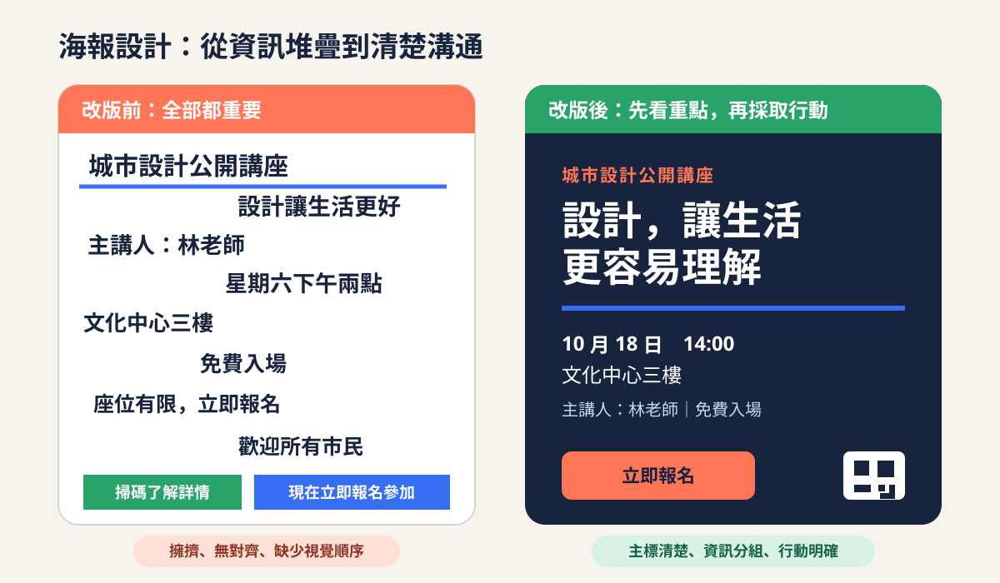
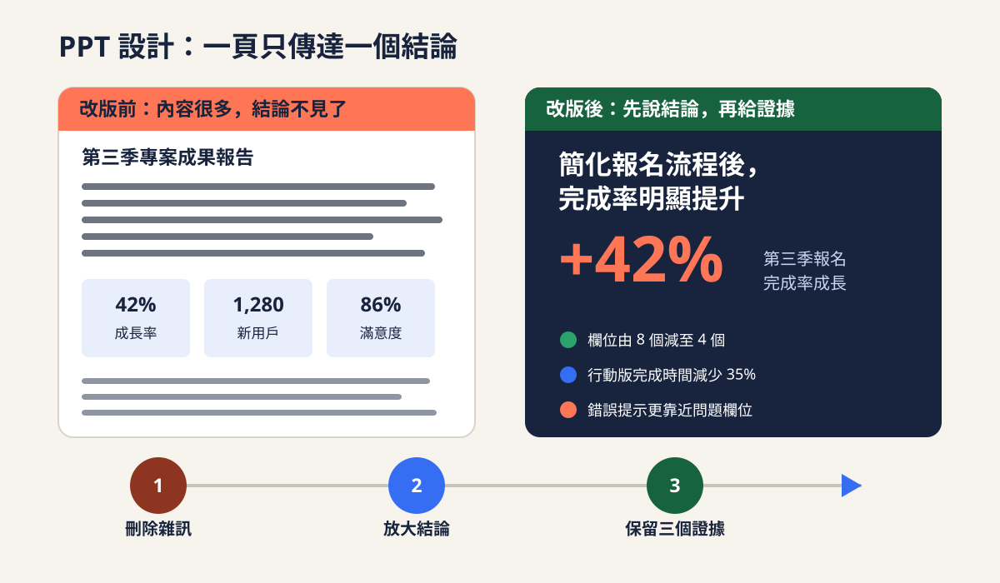
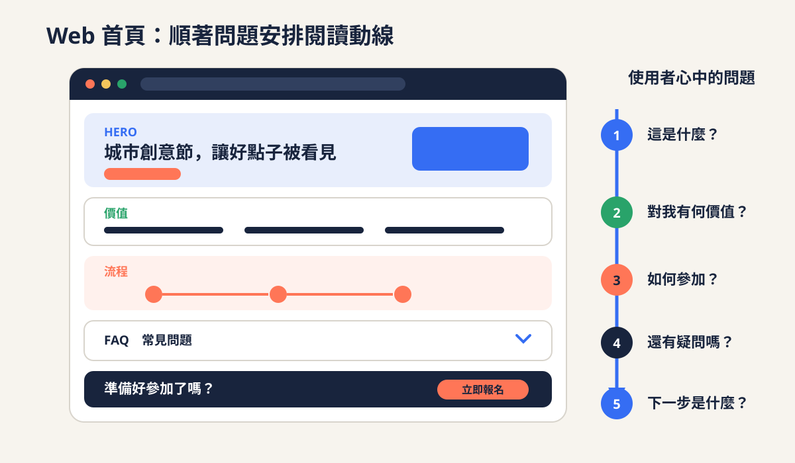

# 第一節：從問題到視覺
> 本節 120 分鐘，從使用者與溝通目標出發，建立可讀的視覺規則，最後完成一張校園公開講座海報的低保真改版。

[tags]
- [blue] 設計思維 30 分鐘
- [purple] 視覺基礎 50 分鐘
- [green] 海報實作 40 分鐘
[/tags]

## 設計思維（30 分鐘）

### 先回答五個問題，再開始排版
- **使用者**：誰會看、他熟悉什麼、在意什麼，以及是否有視力、語言或裝置限制
- **情境**：他在什麼時間、地點與裝置上接觸內容，是快速掃過、坐下閱讀，還是邊走邊操作
- **問題**：目前哪一件事讓他看不懂、找不到、無法比較或不敢行動
- **目標**：看完或操作後，希望他理解、記住、選擇或完成什麼
- **限制**：尺寸、時間、品牌規範、內容量、技術、預算與無障礙要求

[callout type="info" title="30 分鐘教學節奏"]
- 0–8 分鐘：用日常告示拆解使用者、情境、問題、目標與限制
- 8–16 分鐘：走過五步設計流程，示範如何把模糊要求改寫成可驗證目標
- 16–23 分鐘：比較裝飾導向與目標導向的決策方式
- 23–24 分鐘：從海報、PPT、Web、App 四個參考例中只選一例，快速口頭判斷使用者、問題與目標
- 24–30 分鐘：兩人完成造句、互換、圈選與重寫練習
[/callout]

### 把模糊要求改寫成設計命題
- 模糊要求：「做一張年輕、有質感、吸睛的海報。」這些形容詞無法直接驗證
- 設計命題：「讓第一次看到活動的校內學生，在走廊三公尺外三秒內讀到主題、日期與報名方式。」
- 可驗證目標必須包含**對象、情境、資訊或行動、判斷條件**
- 限制不是阻礙，而是取捨依據；當版面有限，必須先決定什麼不能被犧牲

> **設計從選擇開始**
> 顏色、字體與圖片不是起點。先確認誰在什麼情境下需要完成什麼，視覺選擇才有理由。

[flow]
1. 理解使用者 — 訪談、觀察或用既有資料確認需求與閱讀能力
2. 定義問題 — 用一句話描述目前阻礙，避免把解法誤寫成問題
3. 設定目標 — 指定要被看見的資訊、預期行動與成功條件
4. 提出方案 — 先發散多個構想，再依目標與限制收斂
5. 驗證 — 讓真實或相近使用者完成任務，記錄結果後修正
[/flow]

### 裝飾導向與目標導向

[compare label-left="裝飾導向" label-right="目標導向"]
- 先挑喜歡的風格，再把資訊塞進版面 | 先排資訊優先順序，再選支持內容的視覺語言
- 用「好不好看」作為主要判斷 | 用「看不看得懂、找不找得到、做不做得到」判斷
- 每個元素都想搶眼，畫面缺少主次 | 只讓最重要的訊息最突出，其他內容依序退後
- 修改時憑個人偏好反覆嘗試 | 根據使用者回饋與任務結果修正
- 為了填滿空間而增加圖案與文字 | 用留白建立分組，刪除不支持目標的元素
[/compare]

### 四種媒介，同一套問題
- **海報**：使用者在走廊移動中看見；問題是資訊平均大；目標是三秒讀到活動名、日期與報名入口
- **PPT**：觀眾一邊聽一邊看；問題是一頁塞進整段報告；目標是十秒掌握單頁結論與一項證據
- **Web**：訪客從搜尋結果進站；問題是不知道活動是否適合自己；目標是快速確認價值、時間、地點並找到報名按鈕
- **App**：使用者單手操作預約；問題是不知道目前選到哪個時段；目標是完成選擇、確認與收到成功回饋

[callout type="tip" title="兩人練習：用一句話定義問題"]
- 24–26 分鐘：各自任選一個媒介，依「某位使用者在某個情境下，因為某個阻礙，無法完成某個任務」造句
- 26–28 分鐘：互換句子，請同伴圈出使用者、情境、阻礙與任務
- 28–30 分鐘：若有缺項或句子已暗藏特定解法，立即重寫並互相確認
[/callout]

## 視覺基礎（50 分鐘）

### 先守住可讀性
- 可讀性是辨認單一文字是否容易；易讀性是理解整段資訊與閱讀順序是否順暢
- 先在真實尺寸與真實距離測試，再討論風格；螢幕放大到 200% 看得清楚，不代表投影或印刷也清楚
- 先用灰階檢查層級，再加入色彩；若拿掉顏色就失去順序，結構仍不夠穩固
- 每一次強調都會降低其他元素的相對重要性，重點太多等於沒有重點

[callout type="info" title="50 分鐘教學節奏"]
- 0–8 分鐘：可讀性、易讀性與真實情境測試
- 8–16 分鐘：色彩
- 16–24 分鐘：字體
- 24–31 分鐘：留白
- 31–38 分鐘：對比
- 38–44 分鐘：對齊
- 44–50 分鐘：層級與快速診斷
[/callout]

### 色彩：先建立功能，再決定氣氛
- **具體規則**：主色、輔助色、中性色與狀態色分工；一般版面先控制在一個主色、一個強調色與一組中性色
- **具體規則**：正文與背景維持清楚明暗差；狀態不可只靠紅綠區分，還要搭配文字、形狀或線條
- **常見錯誤**：每一段都換顏色、用高飽和互補色放長文、淺灰字放白底、用品牌色硬套所有文字
- **改善方式**：先以黑白完成層級，只把強調色留給標題、連結或主要行動；把色彩用途寫成簡單規則並全頁一致執行

[compare label-left="降低可讀性" label-right="提升可讀性"]
- 黃字放白底，明度接近 | 深色正文放淺色底，保留清楚輪廓
- 紅色同時代表品牌、警告與按鈕 | 品牌色、狀態色與行動色分工
- 用六種鮮色區分類似內容 | 用一種強調色配合標題、分組與標籤
[/compare]

### 字體：讓角色清楚，而不是展示字型數量
- **具體規則**：初學版面使用一至兩套字體；先固定標題、正文、註解三個角色，再調整字重與尺寸
- **具體規則**：正文保持舒適字級與行距，段落行寬避免過長；中文正文每行約 25–40 字可作為起始測試值
- **常見錯誤**：同頁使用多套風格字、用全粗體表達所有重點、正文過小、行距過緊、置中長段文字
- **改善方式**：用同一字族的尺寸與字重建立差異；長文靠左對齊，增加行距與段落距離，並在真實投影或印刷尺寸檢查

[tags]
- [green] 標題：明確、有辨識度
- [blue] 正文：穩定、可長時間閱讀
- [purple] 註解：較弱但仍清楚
- [orange] 強調：少量使用才有效
[/tags]

### 留白：用空間說明哪些內容屬於一組
- **具體規則**：相關元素靠近，不相關元素拉開；卡片內距、段落距與區塊距建立由小到大的層級
- **具體規則**：先保留版面邊界，再安排內容；空間應服務分組與閱讀節奏，不是完成後剩下的區域
- **常見錯誤**：怕浪費空間而塞滿頁面、標題離上一段比下一段更近、卡片四邊內距不一致
- **改善方式**：刪除重複內容，設定固定間距單位，例如 8、16、24、40，並讓同類關係使用同一距離

> **留白也是內容**
> 留白不是「沒有設計」，而是在告訴讀者何處停頓、哪些資訊相屬，以及下一步從哪裡開始。

### 對比：差異要大到看得出來
- **具體規則**：可用尺寸、字重、明暗、色彩、形狀與空間形成對比；一次選一至兩個主要手段即可
- **具體規則**：重要資訊不只稍微放大，而要與次要資訊形成明顯級差，例如 36 與 18，而不是 22 與 20
- **常見錯誤**：所有字都粗、所有按鈕都亮、兩個相近字級彼此競爭、深色底上使用細小淺灰字
- **改善方式**：先降低次要內容，再提高主要內容；從遠處瞇眼看版面，應只剩一個最先被看見的焦點

[callout type="warning" title="不要把強調當成裝飾"]
底線、粗體、亮色、大字與外框都會要求注意力。若同一區同時使用三種以上強調方式，先刪到只保留最能支持目標的一種。
[/callout]

### 對齊：讓眼睛沿著看不見的線移動
- **具體規則**：先選共同左邊界或網格；同類文字、圖片與按鈕共用起點、寬度或基線
- **具體規則**：對齊必須跨區塊延續，不能每張卡片各自看似整齊，合起來卻沒有共同骨架
- **常見錯誤**：元素任意漂浮、同頁混用多個左邊界、長段文字置中、只用空白鍵人工推位置
- **改善方式**：顯示參考線，找出一條主軸；把例外減到最低，並檢查左右邊界與卡片內距是否一致

### 層級：安排讀者先看、再看、最後看
- **具體規則**：每個版面先指定第一層主訊息、第二層關鍵資訊、第三層補充與行動
- **具體規則**：層級同時使用內容順序與視覺權重；標題較大只是手段，位置、留白與對比也要一起支持
- **常見錯誤**：每項資訊大小相同、活動名反而小於裝飾文字、CTA 藏在段落中、閱讀順序需要來回跳動
- **改善方式**：把所有內容列成優先順序，再依序配置尺寸與位置；用三秒測試詢問讀者第一、第二、第三看到什麼

[flow]
1. 縮小 — 把版面縮成縮圖，確認第一眼焦點是否唯一
2. 瞇眼 — 模糊細節，檢查大區塊與明暗對比
3. 灰階 — 暫時移除色彩，確認層級不是只靠色相
4. 拉遠 — 在真實距離測試標題、日期與行動是否可辨認
5. 朗讀 — 依視線順序讀出內容，檢查是否符合任務流程
[/flow]

[quiz type="single"]
Q: 一張活動海報在三公尺外看不清日期，最應優先採取哪個做法？
- [ ] 再增加一種鮮豔顏色，讓畫面更熱鬧
- [x] 提高日期與背景的對比，放大日期並重新安排資訊層級
- [ ] 將所有文字改成粗體，讓每項資訊同樣醒目
- [ ] 填滿剩餘空間，避免版面看起來太空
Hint: 先處理與閱讀任務直接相關的尺寸、對比與層級。
[/quiz]

## 海報實作（40 分鐘）



### 起始媒介與預置材料
- 開始計時前，由教師提供**已預置完整散亂素材**的 A3 直式工作紙與數位模板；學員二選一，不從空白檔案開始
- 紙本版本：一張實際 A3 尺寸（297 × 420 mm）工作紙，包含素材清單、三個縮圖框、A3 版面框、字級與色彩註記欄，另備鉛筆、黑色筆與一支色筆
- 數位版本：畫布預設為 A3 直式（297 × 420 mm），所有素材已放入獨立文字框或圖層，並附三個縮圖框、版面框、QR Code 位置框與註記區
- 零基礎學員只需移動、分組、放大或縮小預置文字框；不需現場安裝字體、建立檔案或繪製插圖
- 本輪交付是黑白低保真版面，搭配預計字級、字重、主色、強調色與 QR Code 位置的文字註記，不製作可掃描 QR Code 或精修視覺

### 任務情境：校園公開講座
- 場景：A3 直式海報張貼於校園走廊與電梯口，觀眾多半在移動中快速掃視
- 主要使用者：對創意、科技或職涯有興趣，但尚未認識講者的大學生
- 主要目標：三秒內理解「這是什麼活動、何時舉行、如何報名」
- 次要目標：停下來後能確認講者背景、地點、適合對象與活動內容
- 成功條件：測試者能在三秒後正確說出活動主題、日期，以及指出報名入口

### 完整散亂素材
- **活動名**：設計如何解決真實問題：從觀察到行動
- **活動性質**：校園創意公開講座 2026
- **講者**：林子安，Fieldnote Design 共同創辦人、服務設計顧問
- **日期**：2026 年 9 月 24 日，星期四
- **時間**：19:00–20:30，18:30 開放入場
- **地點**：創新大樓 2 樓演講廳 A201
- **活動簡介**：從校園與城市案例出發，示範如何觀察使用者、定義問題、提出可測試方案，並分享設計師與非設計背景團隊合作的方法
- **適合對象**：全校學生、社團幹部、專題團隊與對設計思維有興趣者
- **費用與名額**：免費入場，限額 120 人，額滿即止
- **報名截止**：2026 年 9 月 21 日 23:59
- **行動文字**：立即掃描 QR Code 報名
- **報名短網址**：design.example.edu/talk
- **主辦單位**：大學創新中心
- **合作單位**：學生設計學會、職涯發展處
- **備註**：完成報名後將寄發確認信；如需無障礙座位，請於表單中勾選

[callout type="warning" title="實作限制"]
- 版面固定為 A3 直式，不更改活動內容與日期
- 最多使用兩套字體、一個主色、一個強調色與中性色
- 必須保留活動名、講者、日期、時間、地點、CTA、短網址與主辦單位
- 不得用顏色作為唯一分類方式，文字與背景需保持清楚對比
- QR Code 區一律使用標示清楚的預置方框，不需產生或測試真實 QR Code，但必須保留掃描空間與 CTA
- 以黑白低保真草案完成資訊層級，再以文字標註預計字級與色彩，不要求完整排版、精修插畫或特殊效果
[/callout]

### 40 分鐘分配

[timeline]
- 0–5 分鐘 | 圈出任務 | 標記主要使用者、三秒內必須看到的資訊與版面限制
- 5–10 分鐘 | 排優先順序 | 將完整素材分成第一層、第二層與第三層
- 10–18 分鐘 | 畫三個縮圖 | 每個縮圖只用方框與文字線，探索不同焦點與閱讀動線
- 18–30 分鐘 | 完成黑白低保真版面 | 選一個方案安排預置素材，以文字註記預計字級、字重、色彩用途與 QR Code 位置，不做完整精修
- 30–35 分鐘 | 三秒測試 | 請同伴觀看三秒後移開，記錄他先看到與記住的資訊
- 35–40 分鐘 | 修正與說明 | 根據測試調整，寫下三項設計決策與理由
[/timeline]

### 從觀察到檢查

[flow]
1. 觀察 — 圈出散亂素材的重複、競爭與缺少分組之處，確認移動中的閱讀情境
2. 原則 — 選定三層資訊、共同對齊線、固定間距與有限色彩的規則
3. 改版 — 先畫三個黑白縮圖，再用預置素材完成一個黑白低保真版面，補上字級、色彩與 QR Code 位置註記
4. 檢查 — 以實際 A3 尺寸或等比例距離進行三秒測試，再依結果修正層級與分組
[/flow]

### 建議的資訊分層
- **第一層，必須立刻看見**：活動名、日期、CTA
- **第二層，決定是否參加**：講者、時間、地點、活動性質
- **第三層，停下來才閱讀**：簡介、適合對象、名額、截止日、主辦與無障礙備註
- 若所有內容仍放不下，先縮短非必要句子與增加分組，不要先縮小所有文字

[compare label-left="改版前的典型問題" label-right="改版時採用的原則"]
- 活動名、講者、日期與單位同樣大小 | 以任務排序三層資訊，只保留一個主要焦點
- 文字平均散落，邊界與間距不一致 | 建立共同左邊界，以固定間距表達分組
- 多種鮮色與粗體同時搶注意 | 限制色彩與字重，將強調保留給日期與 CTA
- QR Code 孤立在角落，缺少指示 | 將 QR Code、CTA、短網址組成清楚的行動區
- 簡介塞成一大段小字 | 改寫成短句，控制行寬並與主要資訊拉開
[/compare]

### 三秒測試
- 優先將草案以 100% 比例輸出為實際 A3（297 × 420 mm），或把數位畫面校準到實際 A3 尺寸，再讓測試者站在三公尺外
- 若場地只能縮放顯示或輸出，觀看距離必須依線性縮放比例同步縮短；例如 A4 是 A3 邊長的約 70.7%，觀看距離改為約 2.1 公尺，50% 尺寸則改為 1.5 公尺
- 測試前以尺確認紙張或螢幕上的實際顯示尺寸，不可只使用「適合畫面」或未校準的縮放比例
- 只展示三秒後立即遮住，不先解釋活動內容，也不提示要找什麼
- 詢問：「這是什麼活動？哪一天？你下一步可以做什麼？」
- 記錄測試者實際說出的內容，不用設計者原本的意圖替答案補充
- 若三項中有一項答錯，回到層級、尺寸、對比、位置或文字精簡進行修正，再測一次

> **測試版面，不測記憶力**
> 三秒測試不是要求讀者背下所有細節，而是確認最重要的三項訊息是否真的取得優先注意力。

### 完稿前檢查清單
- [x] 第一眼只有一個主要焦點，活動名可在遠距辨認
- [x] 日期、時間與地點分組清楚，不需來回搜尋
- [x] CTA、QR Code 區與短網址彼此靠近，行動方式明確
- [x] 標題、正文與註解角色一致，全文不超過兩套字體
- [x] 文字與背景對比清楚，資訊不只靠顏色區分
- [x] 同類元素沿共同邊界對齊，間距能表達分組關係
- [x] 次要內容已降低權重，簡介沒有擠壓核心資訊
- [x] 三秒測試者能說出活動主題、日期並指出報名入口
- [x] 能用使用者、目標或限制說明至少三項設計決策

[tags]
- [green] 看得懂：資訊層級清楚
- [blue] 找得到：閱讀動線連續
- [purple] 做得到：CTA 明確可見
- [orange] 說得明：決策有目標依據
[/tags]

---

# 第二節：從內容到體驗
> 本節 120 分鐘，先以 25 分鐘建立構圖與版面規則，再用 35 分鐘改造專案成果 PPT，接著以 30 分鐘理解 UX 與資訊架構，最後用 30 分鐘完成社區工作坊首頁的低保真線框。

[tags]
- [blue] 構圖與版面 25 分鐘
- [purple] PPT 實作 35 分鐘
- [orange] UX 與資訊架構 30 分鐘
- [green] Web 實作 30 分鐘
[/tags]

## 構圖與版面（25 分鐘）

### 網格：先建立可重複的骨架
- 網格是欄、列、邊界與間距組成的隱形骨架，幫助不同內容共享位置規則
- 海報可先建立左右邊界與兩欄網格，讓活動主訊息占較寬欄，主辦資訊留在窄欄
- PPT 可用十二欄或簡化的左右欄，把結論與證據放在固定區域，避免每頁重新發明版型
- Web 可用桌面十二欄、手機單欄作為起點；內容順序要能在欄位收合後仍保持合理
- 網格不是把所有元素塞進相同方格，而是提供共同起點、寬度與節奏；需要跨欄時也要有明確理由

### 四個關係原則
- **親密性**：相關內容靠近，不同內容拉開；海報的日期、時間與地點應形成一組，而不是散落三處
- **對齊**：元素沿共同邊界、中心線或基線排列；PPT 的標題、圖表與資料來源若共用左邊界，視線不必反覆找起點
- **重複**：同類內容重複相同字級、色彩、間距與形狀；Web 的所有流程步驟使用一致的編號與標題格式，使用者才能快速辨認模式
- **對比**：用足夠的尺寸、字重、明暗或空間差異建立主次；海報活動名與補充說明若只差兩級字級，讀者很難判斷優先順序

[compare label-left="版面只有整齊" label-right="版面支持任務"]
- 所有內容平均放入等大方框 | 依重要性決定跨欄、寬度與留白
- 每個元素各自置中，看似對稱 | 建立共同對齊線，讓眼睛有連續起點
- 同類資訊使用不同樣式追求變化 | 重複角色規則，降低重新理解的負擔
- 同時放大、加粗、加色每一項內容 | 只強調最重要訊息，主次差異清楚
[/compare]

### 閱讀動線：安排眼睛的下一站
- 閱讀動線是視線從第一焦點移到資訊、證據與行動的順序，不等於在畫面上裝飾箭頭
- **海報例子**：活動名 → 日期與地點 → 講者 → 報名 CTA；若主辦標誌先被看見，應降低其尺寸或對比
- **PPT 例子**：訊息式標題「試辦期間完成率較去年同期高 22 個百分點」→ 同期比較圖 → 一句限制 → 資料來源；觀眾不需先讀完整段落才知道觀察結果
- **Web 例子**：Hero 說明適合誰與能得到什麼 → 三項價值 → 參加流程 → FAQ 排除疑慮 → CTA；手機版不能因左右欄收合而把證據放到結論之前
- 可用縮圖、瞇眼、手指逐項指讀與五秒口述測試，找出焦點太多、順序跳躍或行動入口中斷的位置

[flow]
1. 指定起點 — 圈出讀者第一眼必須看到的主訊息
2. 安排分組 — 以親密性把相關資訊放進同一視覺區塊
3. 建立骨架 — 用網格與共同對齊線固定區塊位置
4. 製造主次 — 以重複維持一致，以對比拉開重要性
5. 走讀終點 — 依預期順序指出每一站，確認最後能抵達行動
[/flow]

[callout type="info" title="25 分鐘教學節奏"]
- 0–5 分鐘：用同一組內容比較沒有骨架、兩欄網格與跨欄焦點三種構圖
- 5–11 分鐘：講解親密性與對齊，現場重排日期、地點、說明與 CTA
- 11–16 分鐘：講解重複與對比，找出「每項都強調」造成的競爭
- 16–21 分鐘：走讀海報、PPT、Web 三個具體例子的第一焦點、分組與終點
- 21–25 分鐘：學員用手指走讀一個版面，寫下需要移動、合併、降低或強化的一項內容
[/callout]

> **構圖是在分配注意力**
> 網格提供秩序，親密性與對齊建立關係，重複降低理解成本，對比決定優先順序；最後都要回到讀者能否順利抵達目標。

## PPT 實作（35 分鐘）

> **先辨認圖例與本次練習的差異**
> 下圖是另一個「第三季報名」案例，數據與本次學生數位借用系統練習不同；只觀察訊息式標題、主指標與三個短證據的視覺層級，不複製圖中的內容或數值。



[callout type="info" title="圖例只示範層級"]
圖中的「+42%」與三項證據屬於另一案例。本次練習仍使用下方 61%、83% 與其他借用系統數據，採一個主指標加最多三個短證據，並以尺寸、位置與留白讓主指標明顯優先。
[/callout]

### 可用材料與畫框方式
- 本頁已提供完成練習所需的情境、原始文字與數據；學員另備一張 A4 空白紙與筆即可開始，不需下載或取得額外模板
- 將 A4 紙橫放，先畫一個約 **24 × 13.5 公分**的 16:9 投影片框；框外保留字級、圖表、刪減與資料限制註記區
- 在紙張空白處先畫兩個約 8 × 4.5 公分的 16:9 縮圖，只用方框、文字線與大數字探索層級
- 若使用熟悉的簡報軟體，可自行建立空白 16:9 頁面，但不需搜尋模板、圖示、照片或新字體
- 交付成果是一張黑白低保真投影片：標明訊息式標題、文字層級、預計字級、圖表類型、強調色用途與閱讀順序，不要求完成品牌美化或精修圖表

### 任務情境：專案成果報告
- 場景：六分鐘校務會議簡報中的一頁，向主管說明「學生數位借用系統」八週試辦成果
- 主要觀眾：沒有參與專案、只知道舊流程常被抱怨的主管與行政同仁
- 單頁目標：十秒內理解試辦期間與去年同期的完成率差異，以及還有哪些伴隨指標值得追蹤
- 核心發現：2026 年八週試辦期間完成率為 83%，較 2025 年同期的 61% 高 22 個百分點
- 解讀限制：兩期申請筆數為 412 與 238，參與對象與情境未證實完全相同，因此不能把差異單獨歸因於新流程
- 成功條件：測試者看十秒後，能說出「試辦期間完成率較去年同期高 22 個百分點」，並指出至少一項限制或短證據

### 一頁密集原始素材

```prompt [label="原始報告頁文字與數據"]
標題：學生數位借用系統專案成果報告
試辦期間：2026/03/02–2026/04/24，共 8 週
參與對象：3 個學系、286 名學生；有效借用申請 412 筆
2025 年同期完成率：61%（238 筆申請）
2026 年試辦期間完成率：83%（412 筆申請，較去年同期高 22 個百分點）
平均填表時間：8 分 40 秒降至 3 分 10 秒，縮短 5 分 30 秒
櫃台補件率：34% 降至 12%，減少 22 個百分點
逾期比例：18% 降至 9%，減少 9 個百分點
滿意度：3.1 分增至 4.3 分（滿分 5 分，回收 201 份）
三項改動：手機表單、即時庫存、到期前 24 小時提醒
質性回饋：多數學生認為可先確認庫存最有幫助；行政同仁認為資料完整度提高
限制：僅試辦 3 個學系、期間 8 週；兩期申請筆數與參與對象可能不同，跨學期成效仍需追蹤
建議：下一學期擴大至 6 個學系，保留提醒功能並測試英文介面
資料來源：器材中心系統紀錄、表單分析與試辦後問卷
```

### 一頁一重點的取捨
- 把「專案成果報告」改為能直接傳達觀察的訊息式標題，例如「試辦期間完成率較去年同期高 22 個百分點」
- 主圖只回答一個問題：兩期完成率有何差異；使用 61% 與 83% 的比較條形圖或大數字，並在旁標出兩期申請筆數
- 次要證據最多保留三項短句，例如填表時間縮短 5 分 30 秒、補件率低 22 個百分點、逾期比例低 9 個百分點；三項字級與位置都要低於主指標
- 22 個百分點是 83% 減 61% 的差值，不是相對成長率；相對成長率約為 36%，但兩期樣本不同，本頁不把它當成因果成效
- 三項改動只能列為試辦背景，不可用箭頭或文字暗示它們已被證明造成差異；限制與資料來源縮成可讀的小區塊，但不可刪除
- 建議移到口頭說明或下一頁，避免同一頁同時回答成果、方法、限制與未來計畫四個問題

[compare label-left="密集原稿" label-right="單頁結論版"]
- 標題只寫專案名稱，觀眾不知道觀察結果 | 標題直接寫出試辦期間較去年同期高 22 個百分點
- 九項數據以相同字級排列 | 一項主指標配最多三項較弱的短證據
- 用長段文字交代三項改動 | 將改動列為背景，不宣稱已證明因果
- 圖、文字、數據平均分配空間 | 圖表約占一半版面，文字只保留解釋與限制
- 資料來源混在正文句尾 | 資料來源固定放在頁尾並保持可讀
[/compare]

### 35 分鐘分配

[timeline]
- 0–5 分鐘 | 觀察問題 | 圈出原稿的核心結論、重複資訊、競爭數據與觀眾真正需要的判斷
- 5–10 分鐘 | 套用原則 | 寫出三個不宣稱因果的訊息式標題候選，選定一項主指標與最多三項短證據
- 10–17 分鐘 | 探索版面 | 在 A4 空白紙畫兩個 16:9 縮圖，指定第一焦點、圖文比例與閱讀順序
- 17–27 分鐘 | 動手改版 | 完成一張黑白低保真投影片，標註標題、正文、數字與來源字級，以及圖表和強調色用途
- 27–32 分鐘 | 十秒測試 | 與同伴交換，展示十秒後詢問同期差異、短證據與一項限制
- 32–35 分鐘 | 對照檢查 | 依測試結果修正，並寫下一項刪除、一項保留與一項強化的理由
[/timeline]

[flow]
1. 觀察問題 — 找出密集原稿同時爭奪注意力的標題、數據、段落與建議
2. 套用原則 — 以一頁一重點、訊息式標題、主次證據與固定對齊線決定取捨
3. 動手改版 — 在空白紙畫 16:9 框並完成低保真版面，補上字級、圖表與色彩註記
4. 對照檢查 — 用十秒口述結果對照同期差異，確認閱讀順序能從標題到證據再到樣本限制
[/flow]

[callout type="warning" title="實作限制"]
- 只製作一張 16:9 投影片，不增加頁面，也不改動原始數值
- 第一層只能有一個訊息式標題與一項主指標；短證據最多三項，且視覺權重必須明顯低於主指標
- 圖表只使用兩期比較條形圖或大數字比較，不使用 3D、圓餅圖或裝飾性圖示
- 圖表與數字區建議占版面 45%–60%，長段文字不得直接貼回投影片
- 必須保留試辦範圍、兩期申請筆數不同、參與對象可能不同與資料來源，但可縮寫成短句
- 標題與註記不可宣稱新流程造成完成率差異，並須正確使用「高 22 個百分點」，不得誤寫成「成長 22%」
- 以低保真版面及註記為交付，不花時間搜尋照片、插圖、字體或動畫
[/callout]

### 對照檢查清單
- [x] 標題是一句可判斷的觀察結果，而不是「成果報告」或章節名稱
- [x] 十秒內能辨認 61%、83% 與高 22 個百分點的關係
- [x] 一項主指標取得最大權重，短證據不超過三項且明顯退後
- [x] 圖表選擇能準確比較兩期數值，沒有誇大差異
- [x] 「百分點」與「相對成長率」沒有混用，也沒有宣稱已證明因果
- [x] 閱讀順序由結論到證據，再到解釋、限制與資料來源
- [x] 文字、數字、圖表與頁尾沿共同網格對齊
- [x] 已標註預計字級、圖表形式與強調色用途
- [x] 試辦範圍、兩期樣本差異、限制與資料來源仍可辨認
- [x] 能說明刪除、保留與強化內容的理由

## UX 與資訊架構（30 分鐘）

### UX 是完成任務的整體經驗
- 使用者體驗（UX）包含進入前的期待、尋找資訊、做出選擇、完成操作、收到回饋與遇到錯誤時的處理
- 使用者介面（UI）是按鈕、表單、色彩、字體與畫面狀態等接觸面；漂亮 UI 可以支持體驗，但不會自動產生清楚 UX
- 評估體驗時先問「使用者能否完成目標、是否知道目前狀態、出錯後能否恢復」，再問畫面風格是否一致

[compare label-left="UI 漂亮但 UX 差" label-right="流程清楚的體驗"]
- 首頁有大型動畫，但看不出活動對象與日期 | 首屏先回答適合誰、何時舉行與能得到什麼
- 所有按鈕都使用漂亮漸層，名稱卻是「了解更多」 | 主要按鈕直接寫「查看場次並報名」
- 導航依內部部門分類，訪客不懂組織名稱 | 導航依使用者任務分成活動、場次、報名與常見問題
- 表單提交後只回到首頁，不知道是否成功 | 顯示確認編號、報名摘要與下一步
- 輸入錯誤後清空全部欄位 | 保留正確內容，在錯誤欄旁說明修正方法
[/compare]

### 資訊架構：讓內容能被理解與找到
- **目標路徑**：先定義使用者從哪裡進入、要做什麼、需要哪些判斷、完成後看到什麼；主要路徑應比次要探索更短
- **內容分組**：把使用者會一起尋找或比較的資訊放在同一群組，例如場次要同時呈現日期、時間、地點與剩餘名額
- **導航**：名稱使用使用者熟悉的詞，層級與選項數量保持可掃讀；目前位置與可返回方向要清楚
- **可尋性**：重要內容同時靠合理位置、清楚標籤與搜尋詞被找到，不能只藏在 FAQ、圖片文字或模糊按鈕後
- **使用者流程**：畫出每一步的行動、系統回饋與必要分支，檢查是否有重複輸入、死路或不必要決策
- **錯誤預防**：在發生前提供格式、限制、即時庫存與確認摘要；發生後指出問題、保留資料並提供恢復方式

### 具體場景：報名週末親子木工課
- 主要使用者：首次造訪網站、使用手機的家長，希望替一位成人與一位 8 歲兒童報名
- 使用者目標：確認年齡、費用、場次與剩餘名額後完成報名，並知道需要攜帶什麼
- 系統限制：每場 12 組、兒童須滿 7 歲、每次只可選一個場次、付款前保留名額 10 分鐘
- 關鍵資訊群組：課程價值與適合對象、場次與名額、費用包含項目、參加流程、安全與取消規則
- 主要流程：首頁確認適合 → 查看場次 → 選擇名額 → 填寫聯絡與兒童資料 → 檢查摘要 → 付款 → 收到確認
- 預防錯誤：場次卡先顯示年齡與名額；兒童年齡不符時立即提示；付款前再次列出日期、人數、總額與取消期限

[flow]
1. 進入 — 從搜尋結果抵達首頁，先確認活動是否適合 8 歲兒童
2. 判斷 — 比較場次、地點、費用與剩餘名額，選擇一個可參加時段
3. 填寫 — 輸入成人聯絡資料與兒童年齡，系統即時檢查必填與資格
4. 確認 — 在付款前查看日期、人數、金額與取消規則，仍可返回修改
5. 完成 — 顯示報名編號、活動摘要、攜帶物品與確認信寄送狀態
[/flow]

[callout type="info" title="30 分鐘教學節奏"]
- 0–6 分鐘：比較 UI、UX 與資訊架構的角色，指出漂亮畫面仍可能阻礙任務的原因
- 6–12 分鐘：用卡片分類法將親子木工課內容分成價值、場次、流程、規則與支援
- 12–18 分鐘：把主要導航與首頁區塊命名成使用者看得懂的標籤，檢查可尋性
- 18–24 分鐘：畫出從進站到收到確認的使用者流程，標記行動、系統回饋與返回路徑
- 24–28 分鐘：加入年齡不符、名額已滿與付款中斷三種錯誤預防及恢復方式
- 28–30 分鐘：兩人互換流程，以「知道在哪裡、知道下一步、出錯能恢復」快速走查
[/callout]

> **清楚不是把選項全部攤開**
> 好的資訊架構會在需要時提供足夠資訊，讓使用者做出當下決定；太早出現的次要選項也會增加理解與選擇負擔。

## Web 實作（30 分鐘）

> **先辨認圖例與本次練習的差異**
> 下圖是另一個「城市創意節」案例，CTA 是「立即報名」；只觀察 Hero → 價值 → 流程 → FAQ → CTA 的內容結構，不複製活動名稱、文案或按鈕文字。



[callout type="info" title="圖例只示範結構"]
本次練習仍使用「週末親子木工小屋」及「查看場次並報名」。圖例只用來走讀五個區塊如何依序回答「這是什麼、對我有何價值、如何參加、還有什麼疑問、下一步是什麼」。
[/callout]

### 可用材料、視窗與畫框方式
- 本頁已提供 Hero、價值、流程、FAQ、CTA 的全部素材；學員另備兩張 A4 空白紙與筆即可完成，不需下載線框模板或元件包
- **桌面視窗**以 1440 × 900 為測試基準：在橫放紙張畫一個 24 公分寬的長頁面框，從頂端向下 15 公分畫出 fold 線，代表 1440 × 900 的第一個視窗
- **手機視窗**以 390 × 844 為測試基準：在直放紙張畫一個 7.8 公分寬的長頁面框，從頂端向下約 16.9 公分畫出 fold 線，代表 390 × 844 的第一個視窗
- 在 fold 線下方延伸頁面，依序安排價值、流程、FAQ 與頁尾 CTA；框旁用箭頭標示桌面多欄如何收合為手機單欄
- 若使用熟悉的設計工具，可自行建立 1440 × 1800 與 390 × 1688 的空白長頁面，並分別在 y=900 與 y=844 標示 fold，不需搜尋模板
- 交付成果為桌面與手機都可理解的低保真首頁線框，清楚標出單一主要 CTA、內容順序、手機收合方式與行動路徑，不要求視覺精修或可點擊原型

[callout type="warning" title="Fold 是本次測試基準，不是固定真相"]
實際首屏高度會隨裝置尺寸、瀏覽器介面、顯示縮放與使用者字級設定改變。本練習固定用桌面 1440 × 900、手機 390 × 844 比較方案；實務上仍需以目標裝置重新測試，不能假設所有人看到相同 fold。
[/callout]

### 任務情境：社區工作坊首頁
- 活動名稱：週末親子木工小屋
- 主要使用者：想為 7–12 歲兒童安排週末活動、以手機搜尋的家長
- 主要目標：先確認活動是否適合，再選擇場次並開始報名
- 成功條件：測試者能在五秒內說出適合年齡與活動價值，並在不受提示下指出報名入口與下一步
- 單一行動路徑：理解活動 → 確認適合 → 查看流程與疑慮 → 找到「查看場次並報名」並預期進入場次頁

### Hero 完整素材
- **主標題**：和孩子一起完成第一座木工小屋
- **副標題**：適合 7–12 歲兒童與一位成人，在安全引導下完成可帶回家的木工作品
- **關鍵資訊**：每週六、日 10:00–12:30；青田社區工房；每組 980 元；每場限 12 組
- **主要 CTA**：查看場次並報名
- **次要文字連結**：先了解安全措施
- **信任資訊**：小班教學、工具與護具已包含、由具兒童教學經驗的木工導師帶領

### 價值、流程、FAQ 與 CTA 素材
- **價值一，親子共同完成**：成人與孩子分工測量、組裝與上色，帶走一件共同作品
- **價值二，安全且適齡**：使用兒童適用工具，開始前有安全示範，操作時由導師巡迴協助
- **價值三，材料一次備妥**：木料、工具、護目鏡、圍裙與顏料皆包含，不需自行購買
- **參加流程一**：選擇日期與剩餘名額；每次報名一位成人加一位兒童
- **參加流程二**：填寫聯絡資料、兒童年齡與過敏備註
- **參加流程三**：確認 980 元費用與取消規則後付款，收到報名編號與行前通知
- **FAQ，沒有木工經驗可以參加嗎**：可以，內容從工具認識開始，導師會逐步示範
- **FAQ，可以帶兩位兒童嗎**：每組限一位成人與一位兒童；兩位兒童需分別報名兩組
- **FAQ，年齡未滿 7 歲可以參加嗎**：本課程需操作工具，未滿 7 歲不開放報名
- **FAQ，臨時無法出席怎麼辦**：活動前 7 日可全額退費；3–6 日可改期一次；2 日內不退費
- **FAQ，需要攜帶什麼**：穿著包覆腳趾的鞋與方便活動的衣物，其餘材料和護具由工房提供
- **頁尾 CTA 標題**：準備好一起動手了嗎
- **頁尾 CTA 說明**：先查看即時剩餘名額，選擇適合的週末場次
- **頁尾 CTA 按鈕**：查看場次並報名

### 30 分鐘分配

[timeline]
- 0–4 分鐘 | 觀察問題 | 圈出家長進站後必須先回答的適齡、價值、時間、費用與安全疑慮
- 4–8 分鐘 | 套用原則 | 將素材分成 Hero、價值、流程、FAQ、CTA，指定單一主要行動與區塊順序
- 8–13 分鐘 | 安排桌面版 | 在空白紙畫桌面長頁面與 1440 × 900 fold，安排從 Hero 到頁尾 CTA 的閱讀動線
- 13–19 分鐘 | 動手改版 | 補上關鍵內容、場次入口、按鈕文字與 FAQ 展開方式，不做精修
- 19–24 分鐘 | 轉為手機版 | 在空白紙畫手機長頁面與 390 × 844 fold，將多欄收合成順序合理的單欄
- 24–27 分鐘 | 五秒走查 | 只展示標記的視窗範圍五秒後遮住；不提示，請同伴指出他預期點選的報名位置，不要求實際點擊
- 27–30 分鐘 | 對照檢查 | 依結果修正一個順序、一個標籤或一個行動入口，寫下理由
[/timeline]

[flow]
1. 觀察問題 — 找出素材中使用者先做判斷必須知道的內容，以及可能阻礙報名的疑慮
2. 套用原則 — 依目標路徑分組 Hero、價值、流程、FAQ 與 CTA，指定唯一主要按鈕
3. 動手改版 — 在空白紙畫桌面與手機長頁面、標示 fold，完成低保真線框與收合順序
4. 對照檢查 — 以五秒口述及不提示指出預期點選位置，確認使用者能理解並找到報名入口
[/flow]

[callout type="warning" title="實作限制"]
- 必須使用本頁提供的五個內容區塊，不新增購物、會員、社群牆或裝飾性區塊
- 全頁主要 CTA 只使用「查看場次並報名」，Hero 與頁尾可重複，但不得出現另一個競爭行動
- Hero 必須在本次指定的桌面與手機 fold 之前回答適合年齡、活動價值與主要 CTA；不得只放氛圍圖片或口號
- 桌面可使用多欄，手機必須收合成單欄；收合後內容仍依理解與決策順序排列
- FAQ 可用手風琴註記，不需設計開合互動；必須保留年齡、同行人數與取消規則
- 只完成線框、文字層級與互動註記，不搜尋圖片、不製作 Logo、不挑選最終色彩與字體
[/callout]

### 對照檢查清單
- [x] Hero 在五秒內說清楚活動、適合年齡與可獲得的體驗
- [x] 主要 CTA 全頁名稱一致，能直接預期下一步是查看場次
- [x] 桌面 1440 × 900 與手機 390 × 844 的測試範圍都已標示 fold
- [x] 價值、流程與 FAQ 各自分組，標題能被快速掃讀
- [x] 時間、地點、費用與名額在做決定前可以找到
- [x] 安全、同行人數、年齡與取消疑慮都有對應資訊
- [x] 桌面與手機內容順序都從理解、判斷走向行動
- [x] 手機版沒有因多欄收合而把說明與標題拆散
- [x] 同伴在不受提示下能指出預期點選的報名位置，不需操作可點擊原型
- [x] CTA 前後都有足夠理由支持行動，不以模糊的「了解更多」取代
- [x] 能用目標路徑說明至少三項分組、排序或刪減決策

[quiz type="single"]
Q: 社區工作坊首頁的手機版空間有限，最適合優先保留哪一組首屏內容？
- [ ] 大型裝飾圖片、主辦單位沿革與社群貼文
- [x] 活動價值、適合年齡、關鍵場次資訊與「查看場次並報名」
- [ ] 五題 FAQ 的完整答案與所有取消條款細節
- [ ] 兩個同樣醒目的按鈕，讓使用者自行決定先看哪裡
Hint: 首屏先支持「這是否適合我」與「下一步怎麼做」兩個判斷。
[/quiz]

[tags]
- [green] 理解：先回答是否適合
- [blue] 尋找：資訊分組與標籤清楚
- [purple] 行動：主要路徑連續
- [orange] 恢復：錯誤可預防也可修正
[/tags]
